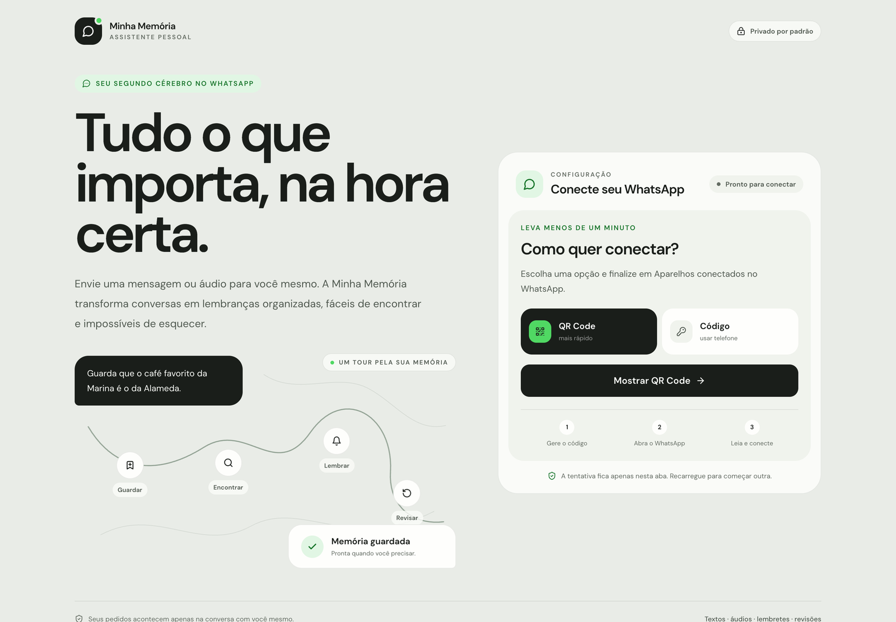
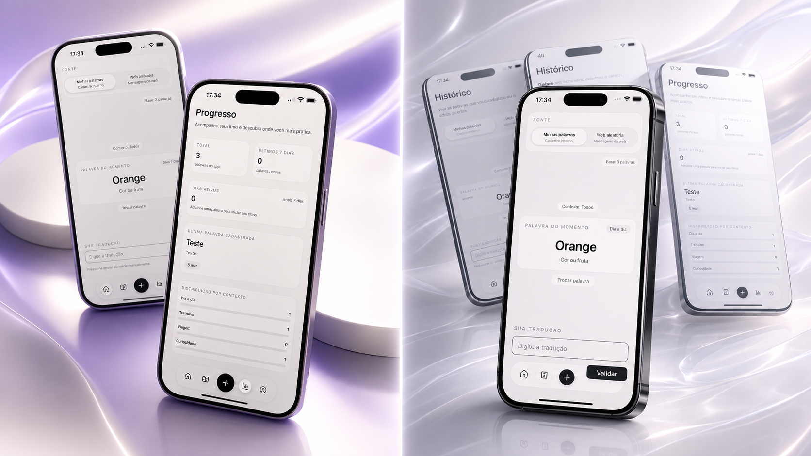

<h1 align="center">Jean Duarte</h1>

<strong>Desenvolvedor pleno</strong>

  Gosto de transformar ideias em produtos que façam sentido no dia a dia. 
  Este espaço reúne o que estou construindo e a evolução de cada projeto.

  

<h2>Projetos em destaque</h2>

<table>
  <tr>
    <td colspan="2" valign="top">
      
      <h3>Teresa</h3>
      

        Uma aplicação de inteligência criativa que transforma ideias, referências e sinais das
        redes sociais em tópicos e roteiros de conteúdo.
      

      

        <a href="https://github.com/Jeanduarty/teresa"><strong>Ver projeto →</strong></a>
      

    </td>
  </tr>
  <tr>
    <td width="50%" valign="top">
      
      <h3>WhatsApp Memory Assistant</h3>
      

        Um projeto para guardar e recuperar informações pelo WhatsApp, tornando registros e
        revisões parte de uma conversa comum.
      

      

        <a href="https://github.com/Jeanduarty/whatsapp-memory-assistant"><strong>Ver projeto →</strong></a>
      

    </td>
    <td width="50%" valign="top">
      
      <h3>Vocabulary Trainer</h3>
      

        Um aplicativo mobile para cadastrar palavras, praticar traduções e acompanhar o progresso
        de forma simples.
      

      

        <a href="https://github.com/Jeanduarty/vocabulary-trainer"><strong>Ver projeto →</strong></a>
      

    </td>
  </tr>
</table>
